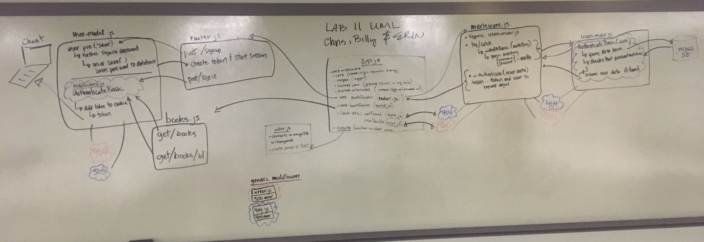

 LAB
=================================================

## Authentication

### Author: Erin Trainor working with Chris Merrit and Bill Bunn

### Links and Resources
* [pull request](https://github.com/401-advanced-javascript-401d29/lab-11/pull/2)
* [travis][](https://www.travis-ci.com/401-advanced-javascript-401d29/lab-11)
* [heroku](https://auth-server-401javascript.herokuapp.com/)

#### Documentation
* [jsdoc](https://auth-server-401javascript.herokuapp.com/docs/)

## Instructions
`echo '{"username":"Billy", "password":"supersecret"}' | http :3000/signup`
`http post :3000/signin -a Billy:supersecret`
`http :3000/books -a Billy:supersecret`
`http :3000/books/2 -a Billy:supersecret`
## Bug fixes
#### `app.js`
* added `app.use(authRouter)` to `app.js` before catch-all middleware
#### `router.js`
* changed `/signin` route to use `app.post()` instead of `app.get()`
#### `users-model.js`
* added required 3rd-party middleware to `users-model.js`:
  * `const bcrypt = require('bcrypt');`
  * `const jwt = require('jsonwebtoken');`
* fixes unhandled promise in `users.methods.comparePassword`; after `bcrypt.compare()`, added a `.then()` that compares the password entered in `/signin` to the hashed password stored in the database, and return `this` (the user document) or `null`.
#### `middleware.js`
* changed all instances of `encodedString` to `authString`
* passed `authString` as an argument into function `_authBasic()`
* added lines to `_authenticate` to attach the user data and token to the request object:
```
function _authenticate(user) {
  if (user) {
   req.user = user;
   req.token = user.generateToken();
   next();
  }
  else {
   _authError();
  }
 }
```
* change `auth` variable inside `_authBasic` function add `username` and `password` to an **object** instead of an array.
## Book routes authentication
#### `app.js`
* wired `books.js` to routes; used _after_ `authRouter`
```
const bookRouter = require('./routes/books.js');
app.use(bookRouter);
```
#### `books.js`
* added authentication middleware to book routes
```
const auth = require('../auth/middleware.js');
router.get('/books', auth, handleGetAll);
router.get('/books/:id', auth, handleGetOne);
```

### Setup
#### `.env` requirements
* `PORT` - 3000
* `MONGODB_URI` - MONGODB_URI=mongodb://localhost:27017/authorization
* `SECRET` - set by tester

#### Running the app
* To run Mongo
  * Open 3 terminal tabs
    * First tab
      * mongod --dbpath=/Users/erintrainor/codefellows/data/db (substitute your file path)
    * Second tab
      * mongo
    * Third tab
      * nodemon

* Signup a user to the database
  * echo '{"username" : "erin", "password":"buggy"}' | http post :3000/signup

* Signin a user to the database
  * http post :3000/signin -a erin:buggy

* Signin to the books route
  * http get :3000/books -a erin:buggy

* Signin to the books/id route
  * http get :3000/books/1 -a erin:buggy


  
#### Tests
* How do you run tests?
  * npm run test
* What assertions were made?
  * currently only the tests that are in the sampl code
* What assertions need to be / should be made?
  * tests for book routes

#### UML


